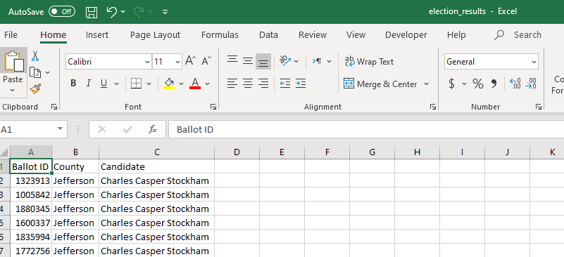

# Election Analysis

## Project Overview
A Colorado Board of Elections employee has been given following tasks to complete the election audit of a recent local congressional election.

1. Calculate the total number of votes cast.
2. Get a complete list of candidates who received votes.
3. Calculate the percentage of votes each candidate won.
4. Caclulate the percentage of votes each candidate won.
5.Determine the winnier of the election based on popular vote.

In addition to Candidate analysis , Board has asked to provid additional results by county also.
1. The voter turnout for each county
2. The percentage of votes from each county out of the total count
3. The county with highest turnout

## Resources
- Data source: election_results.csv [Link to election results raw data](Resources/election_results.csv)
- Software: Python 3.7, Visual Studio Code Version 1.52.1
- Link to the python program created to process election results and generate output: [PyPoll_Challenge.py](PyPoll_Challenge.py)
- Data source "election_results.csv" format : see the below screenshot to see the expected file format for data source.

  

## Election Audit Results
The analysis of the election show that:
- There were 369,711 votes cast in the election.

### County results Analysis:
- The county votes breakdown:
  - Jefferson: 10.5% (38,855)
  - Denver: 82.8% (306,055)
  - Arapahoe: 6.7% (24,801)
- The county with the largest turnout is Denver.

### Candidate Analysis:
- The candidates were:
  - Charles Casper Stockham
  - Diana DeGette
  - Raymon Anthony Doane
- The candidate results were:
  - Charles Casper Stockham received 23.0% of the vote and 85,213 number of votes.
  - Diana DeGette received 73.8% of the vote and 272,892 number of votes.  
  - Raymon Anthony Doane received 3.1% of the vote and 11,606 of votes.
  
#### Winning Candidate:
The winner of the election was:
  - Diana DeGette who received 73.8% of the vote and 272,892 number of votes.
 
 ### Analysis output file:
 The election results analysis is also provided in the [Election Results output](Analysis/election_analysis.txt)
 
 ## Summary
 
The program created for this election analysis could also be used for any other election results analysis to output candidate and county anaysis given that:
- Election results are provided in the format. [Election results data source format](Resources/Election_results_format.png).
- Also note that the program doesn't check for duplicate ballot id, so the data source should be a cosolidated ballot information from all voting methods and have unique ballot ids.

The code can be run with following modifications to point to a new election results file.

1. Modify the file_to_load variable to point to the new file name and path. The expectation is that file is location in subfolder "Resources" where the code "PyPoll_Challenge.py" is saved. you can change the file name "election_results.csv" to the new file name.
    - file_to_load = os.path.join( "Resources", "election_results.csv")
2. Also change the variable "file_to_save" to use a different output file name.
    - file_to_save = os.path.join("Analysis", "election_analysis.txt")
  

 
 
 
